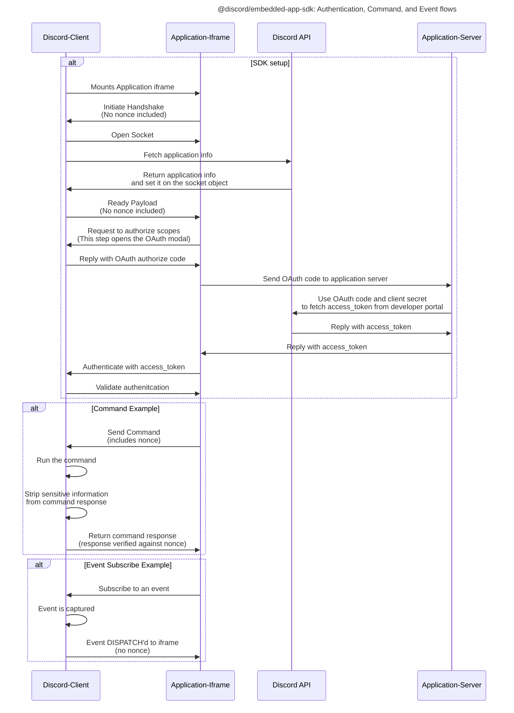

# @discord/embedded-app-sdk

<p align="center">
  
<p>

This library enables communication between your Application and Discord. Whether launched via Discord's web app, desktop app, iOS, or Android, `@discord/embedded-app-sdk` provides a unified API that enables your application to integrate a real-time website inside of Discord's UI via an embedded iframe.

- [Installing this package](#installing-this-package)
- [Quick Start](#quick-start)
- [Common Patterns](#common-patterns)
- [Production Readiness](#production-readiness)
- [Examples](#examples)
- [Security Notice](#security-notice)
- [SDK development](#sdk-development)

## Installing this package

TODO - remove `github:` prefix once public npm package is available

```shell
npm install github:@discord/embedded-app-sdk
```

## Quick Start

Learn how to set up your application to launch an iframe inside of Discord [here](/docs/setting-up-your-iframe.md).

## Common Patterns

Learn about common patterns that your application may want to use [here](/docs/common-patterns.md).

## Production Readiness

Making a polished application takes time. Once your application is ready for production, we have a list of best practices to consider [here](/docs/common-patterns/production-readiness.md)

## Examples

- [discord-application-starter](/examples/discord-application-starter) is a minimal example
- [iframe-playground](/examples/iframe-playground) is a playground for testing any @discord/embeddedd-app-sdk functionality
- [react-colyseus](/examples/react-colyseus/) shows how to set up shared application state with Colyseus and React

## Usage

To use the SDK, import it into your project and construct a new instance of the DiscordSDK class.

Below is a minimal example of setting up the SDK.
Please see [/examples/discord-application-starter](/examples/discord-application-starter) for a complete example application. See more info on environment variables (`YOUR_OAUTH2_CLIENT_ID`, etc...) [here](/docs/setting-up-your-discord-application.md#oauth2).

```typescript
import {DiscordSDK} from '@discord/embedded-app-sdk';
const discordSdk = new DiscordSDK(YOUR_OAUTH2_CLIENT_ID);

async function setup() {
  // Wait for READY payload from the discord client
  await discordSdk.ready();

  // Pop open the OAuth permission modal and request for access to scopes listed in scope array below
  const {code} = await discordSdk.commands.authorize({
    client_id: YOUR_OAUTH2_CLIENT_ID,
    response_type: 'code',
    state: '',
    prompt: 'none',
    scope: ['identify'],
  });

  // Retrieve an access_token from your application's server
  const response = await fetch('/api/token', {
    method: 'POST',
    headers: {
      'Content-Type': 'application/json',
    },
    body: JSON.stringify({
      code,
    }),
  });
  const {access_token} = await response.json();

  // Authenticate with Discord client (using the access_token)
  auth = await discordSdk.commands.authenticate({
    access_token,
  });
}
```

Here is a corresponding flow diagram to the code-snippet above:



## SECURITY NOTICE

This is simply the nature of client apps but it bears repeating. **Do not trust data coming from the Discord client as truth.** It's fine to use this data in your application _locally,_ but assume any data coming from the Discord Client could be falsified. That includes data about the current user, their nitro status, their current channel, etc. If you need this information in a trusted manner, contact Discord API directly from your application's server, with the user token you received from completing the OAuth2 flow.

Want to learn more about "what the heck is this library actually doing ™️"? Read more about how the underlying postMessage protocol is set up [here](/docs/common-patterns/post-message-protocol.md).

## SDK development

Developing a new feature or patching a bug on the SDK? Check out [this guide](/docs/common-patterns/local-sdk-development.md) to learn how to set up your local dev environment.
