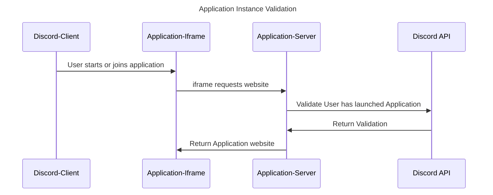

# Preventing unwanted application sessions

Activities are surfaced through iframes in the Discord app. The application website itself is publicly reachable at `<application_id>.discordsays.com`. Activities will expect to be able to communicate with Discord's web or mobile client via the Discord SDK's RPC protocol. If a user loads the application's website in a normal browser, the Discord RPC server will not be present, and the application will likely fail in some way.

It is theoretically possible for a malicious client to mock Discord's RPC protocol or load one application website when launching another. Because the application is loaded inside Discord, the RPC protocol is active, and the application is none the wiser.

To enable an application to "lock down" application access, we encourage utilizing the `application instances` API, found at `discord.com/api/activities/<application_id>/instances/<channel_id>`. The route requires a Bot token of the application. It returns a list of active application instances for the given application in the given channel (at the moment, the list will always either be of length 0 or length 1, as we do not allow multiple instances of the same application). Here are two example responses:

```jsx
curl https://discord.com/api/activities/987654321987654321/instances/987654321987654321 -H 'Authorization: Bot <bot token>'
{"instances": []}

curl https://discord.com/api/activities/987654321987654321/instances/987654321987654321 -H 'Authorization: Bot <bot token>'
{"instances": [{"application_id": "987654321987654321", "channel_id": "987654321987654321", "users": ["987654321987654321"], "instance_id": "abcdabcd-1234-5678-9012-123456781234"}]}
```

With this API, the application's backend can verify that a client is in fact in an instance of that application, in a specific channel, before allowing the client to participate in any meaningful gameplay. How an application implement's "session verification" is up to them. The solution can be as granular as gating specific features or as binary as not returning the application HTML except for valid sessions.

In the below flow diagram, we show how server can deliver the application website, only for valid users in a valid application seession


