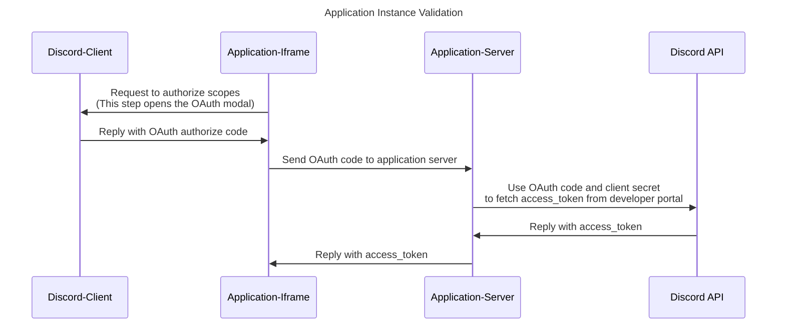

This readme will document all of the steps required to 🚀 launch 🚀 an Application inside of Discord, including the following:

- [Prerequisites](#prerequisites)
- [Installing `@discord/embedded-app-sdk`](#installing-embedded-app-sdk)
- [Creating a Discord Application](#creating-a-Discord-application)
- [URL Mapping](#url-mapping)
- [A note about application access](#a-note-about-application-access)
- [Running your application](#running-your-application)
- [Launching your application](#launching-your-application)
- [Explore Common Patterns](#explore-common-patterns)

## Prerequisites

In order to build an Application in Discord, you will need to use Discord's `embedded-app-sdk`. This SDK assumes that you are familiar with, and have installed [NodeJS](https://nodejs.org/).  
Creating a Discord application requires that you have a Discord account. You will use the account to log in to the developer portal and create an application.

## Creating a Discord Application

We will be creating an application via the Discord developer portal. To create an application, visit https://discord.com/developers/applications.
You will log in with your standard Discord account credentials.  
On first login, it may re-route you to the discord app. If it does, you will need to re-visit [the portal](https://discord.com/developers/applications).  
Once logged in to the developer portal, click the "New Application" button, and name your application.

Adding more info/art for your application is not necessary, but if you'd like to learn more, check out [Setting Up the Application Shelf](/docs/common-patterns/setting-up-the-application-shelf.md)

## OAuth2

In order to use Discord-related info (for example, the user's username, avatar, guild icon, etc...) a user must agree to granting OAuth "scopes" to your application. Learn more about scopes [here](https://discord.com/developers/docs/topics/oauth2#shared-resources-oauth2-scopes).

There are 2 OAuth2 identifiers your app will need to reference, [CLIENT ID](#client-id) and [CLIENT SECRET](#client-secret) which can be found in the OAuth2 tab on the developer portal, as shown here:  

### Client ID

Also known as the Application ID. This is the public facing id linked to your application

### Client Secret

This is a private identifier that your app will use to grant an OAuth2 `access_token`. It should never be stored in the client javascript code.

### OAuth2 Flow

Here is a common pattern for granting a user an OAuth2 access_token:

An example implementation of this OAuth2 flow can be found here

- [Back-end code](/examples/discord-application-starter/packages/server/src/app.ts)
- [Front-end code](/examples/discord-application-starter/packages/client/src/main.ts)

### Bot Token

You may want a bot token, in order to surface bot-enabled features, such as [in-application purchases](/docs/common-patterns/in-application-purchases.md). To generate a bot token for your application, go to Bot -> Build a Bot in the developer portal for your application. Then click "Reset Token" to generate a new bot token. Note: this is not required.

**You must set up a OAuth2 redirect URI in order for this example to work.**  
The URI should point to the location where you host your app. If you don't yet have a url, you should fill in the field with a placeholder, such as `https://127.0.0.1`.

## Marking your Application as "Embedded"

⚠️ **Get ready to phone-a-friend** ⚠️  
Once you’ve created your application, you will need to reach out to Discord to have your application marked as "Embedded". Discord will need you to provide your application ID. It can be found in the developer portal url, as well as in the `General Information` tab (shown in picture below). You will not be able to launch your application until the application is marked as "Embedded". Once your application is marked as embedded, you will have access to an additional set of `EMBEDDED APPLICATION` settings, including `Settings`, `URL Mappings`, and `Art Assets`.

## Supported Platforms

By default, your embedded application will be "launchable" on web/desktop. To enable or disable support for Web/iOS/Android, do the following:

- Visit the developer portal
- Select your application
- Select `Embedded Application` -> `Settings` in the left-side of the developer portal, or visit `https://discord.com/developers/<your app id>/embedded/settings`
- From check the appropriate checkboxes in the developer portal, and save your changes

## URL Mapping

Read about the specific rules and details for URL mapping [here](/docs/common-patterns/url-mapping.md).

In order to serve your application's website, you will need to set up a URL mapping to where your site located.
| PREFIX | TARGET | NOTES |
| ------ | ------ | ------|
| `/` | `your-application-host-url.com` | This is used for serving your application's website. If you don't have a host yet for your site, you can set this to a placeholder, such as google.com |

## A note about application access

⚠️ Members of application development teams should beware that using your application can lead to "leaking" the application ID. Consider modifying your [Application Privacy Settings](https://support.discord.com/hc/en-us/articles/7931156448919#h_01G9ZXP8R9CSNVDBCVTNM3H16S) to prevent your application ID from broadcasting to other Discord users. If your application ID is leaked, without proper mitigation, malicious users will be able to load your application, even before it is released. Discord offers a solution to gate leaked application IDs from being launch-able by malicious users, which is described [here](/docs/common-patterns/preventing-unwanted-application-sessions.md).

While developing your application, it will only be "launch-able" or "join-able" by your user, or by any member of your application's team. It often makes sense to make a team and set the team as the application's owner, especially if you know that you will be collaborating with others during the development phase.

## Running your application

There are several ways that you can run your application

- Via your local server
- Via a local server, running through a network tunnel
- Via a deployed site (This is how your final, productionized application, will be set up)

Depending on your constraints, there are pros/cons to each of these approaches. We suggest starting by [running an application through a network tunnel](/docs/common-patterns/running-your-application.md#running-an-application-through-a-network-tunnel), but also please check out other ways of running your application as well [here](/docs/common-patterns/running-your-application.md).

## Launching your Application

With your application up and running you will now be able to launch your application on web/desktop/mobile via the Developer Application Shelf. Learn more [here](/docs/common-patterns/launching-your-application.md)

## Explore Common Patterns

By the end of this guide you should have all the info you need to get an application up and running in Discord. Now that you have the basics down, let's explore some [common patterns](/docs/common-patterns.md).
